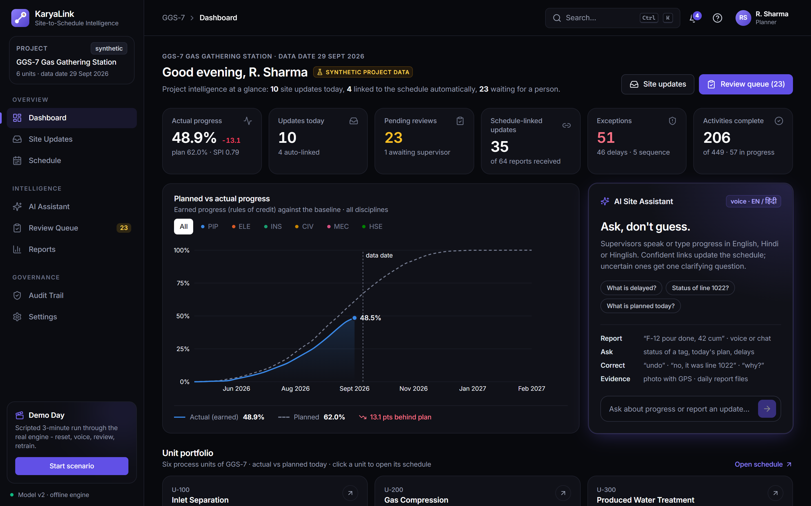
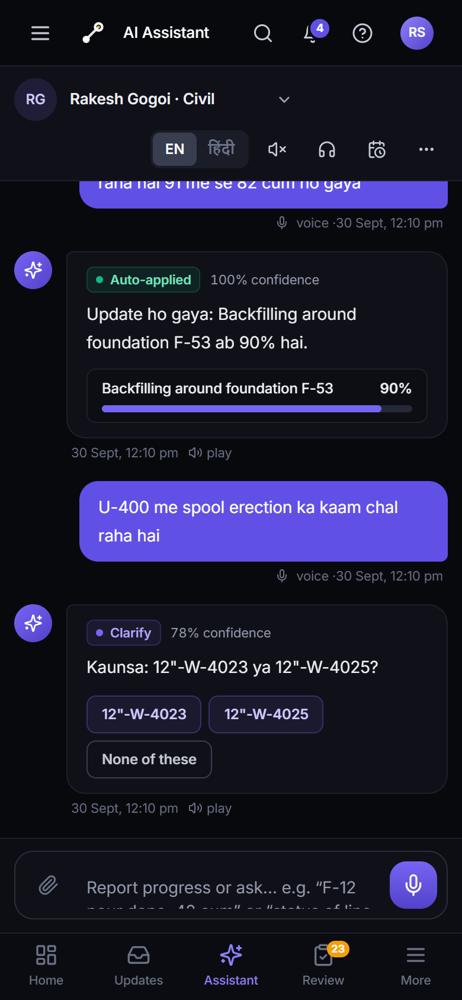
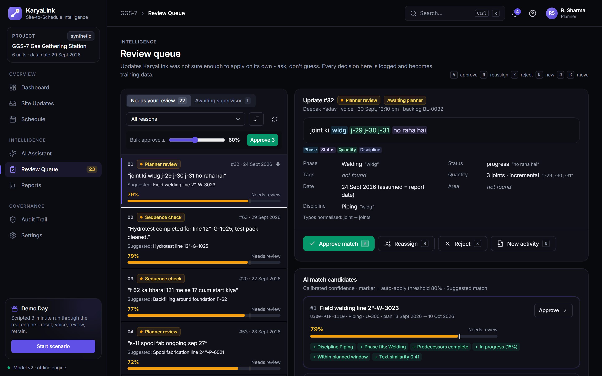
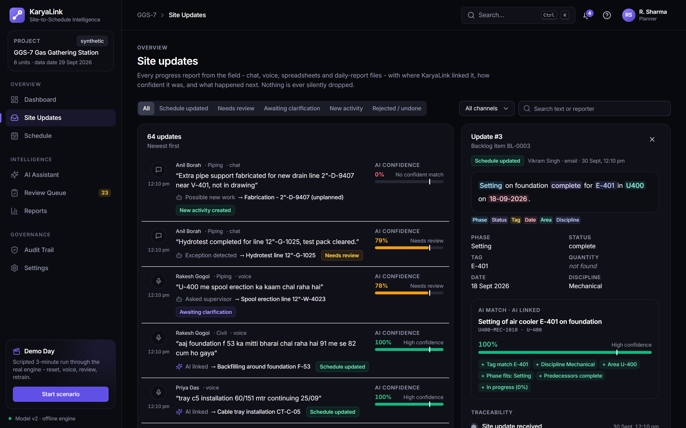
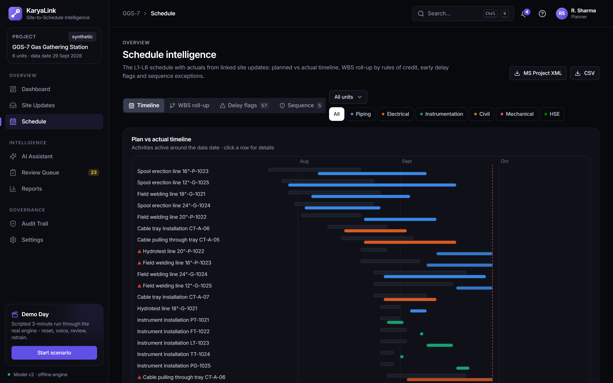
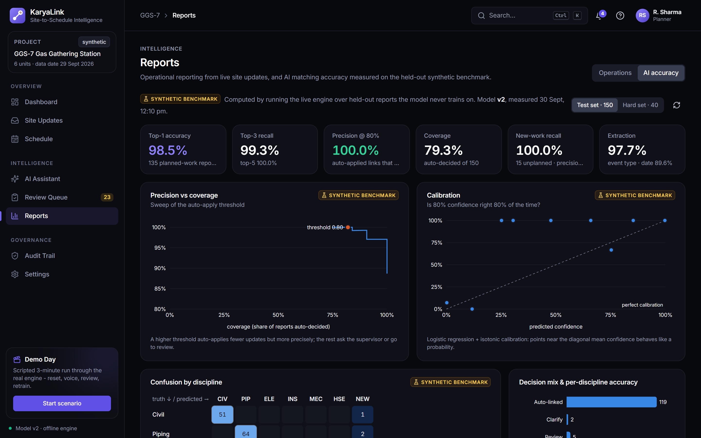
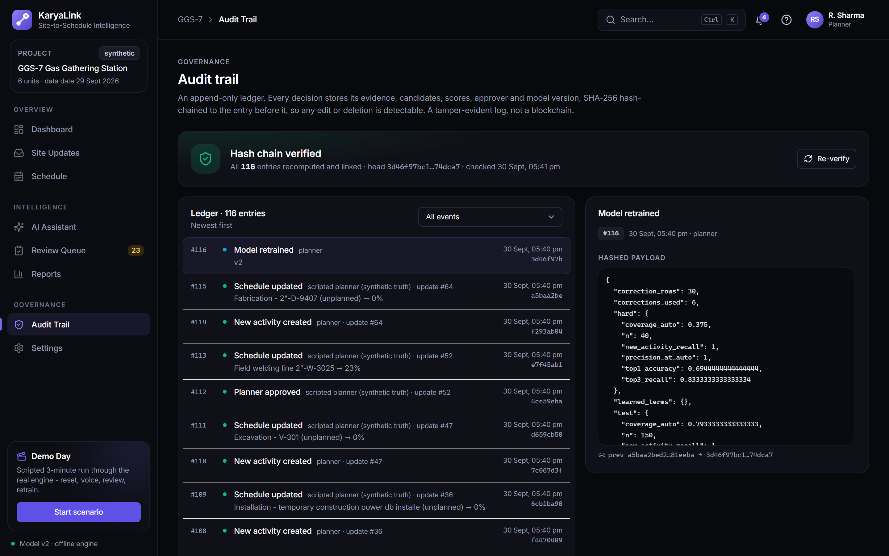
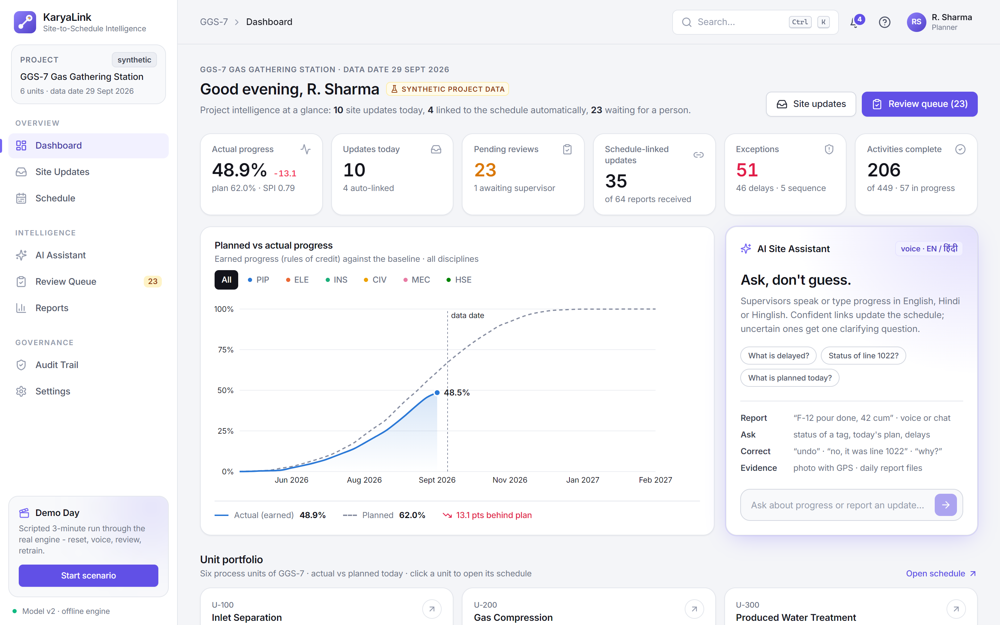
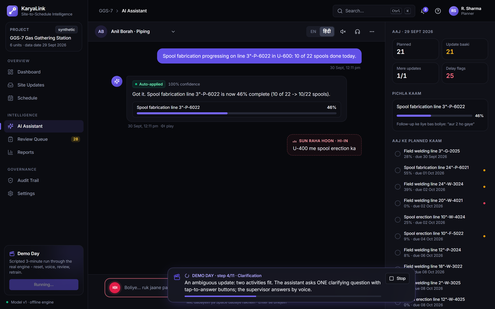
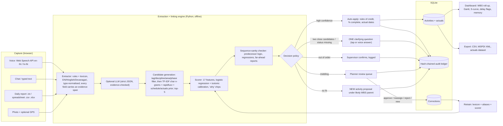

# KaryaLink — Site-to-Schedule Intelligence

**Smart India Hackathon 2026 · Problem Statement SIH26122 (Oil India Limited)**
*"Intelligent Data Capture & Schedule-Linking Layer for Infrastructure Project Management: Real-Time Actual Progress Tracking"*

KaryaLink takes the messy progress updates that site supervisors actually send, such as free text, spreadsheets, chat and voice (in English, Hindi or Hinglish), and turns them into actual start, finish and percent-complete events. It links each event to the right **L5/L6 schedule activity**, with a **calibrated confidence**, **evidence**, and a **tamper-evident audit trail**.

Confident links are applied automatically. Uncertain ones become one clarifying question for the supervisor, or go to a planner review queue. Work that isn't in the plan is proposed as a new activity. **Nothing is ever silently dropped.**

> Everything runs **offline with no API keys**. All data is **synthetic** (a fictional gas gathering station, "GGS-7"). Every accuracy number in the UI is computed live on a held-out synthetic benchmark and is labelled as such.

| Dashboard | AI Assistant (mobile) | Review queue |
|---|---|---|
|  |  |  |
| **Site updates** | **Schedule** | **Reports · AI accuracy** |
|  |  |  |
| **Audit trail** | **Light appearance** | **Demo Day** |
|  |  |  |

---

## How to run

**Requirements:** Node 18+ (tested on 22), Python 3.10+ (tested on 3.13). Nothing else, and no API keys.

```bash
npm install        # installs root + frontend deps, then creates .venv and pip-installs the backend
npm run seed       # generates the synthetic dataset, seeds SQLite, trains + evaluates the scorer (~15 s)
npm run dev        # backend (FastAPI :8000) + frontend (Vite :5173) together
```

Then open **http://127.0.0.1:5173**, click **Start scenario** on the Demo Day card in the sidebar, and press **Start Demo Day**. It takes about 3.5 minutes; turn your speakers on.

| Command | What it does |
|---|---|
| `npm run setup` | (Re)create `.venv` and install backend deps. `npm install` runs this automatically; use it if Python was missing at install time. |
| `npm run seed` | Deterministic synthetic data (fixed seed 2026), DB seed, model v0 baseline and v1, metrics. |
| `npm run dev` | Starts both servers via `concurrently`. If the DB is missing, the API seeds it on first start. |
| `npm test` | Backend `pytest` suite (63 tests), then frontend type-check (`tsc`). |
| `npm run build` | Production frontend build. After building, the FastAPI app also serves `frontend/dist`. |
| `npm run screenshots` | Captures the 9 screenshots above with Playwright. It uses the bundled Chromium, or falls back to the installed Edge or Chrome. Needs `npm run dev` running. |

**Optional LLM assist:** set `ANTHROPIC_API_KEY` (and optionally `SITESYNC_LLM_MODEL`, default `claude-opus-5-5`). The extractor then asks the model for strict-JSON fields, each with a quoted evidence span. **Any field whose evidence is not literally present in the source text is rejected.** LLM fields only fill gaps left by the rules and never override them. Any error falls back to the offline path. The benchmark always runs offline so the numbers are reproducible.

---

## Architecture



**Stack:** FastAPI · SQLAlchemy 2 / SQLite · scikit-learn · rapidfuzz · numpy/pandas · pytest | React 18 · TypeScript · Vite · Tailwind · Recharts · Web Speech API.

```
backend/sitesync/
  seed/        schedule.py (L1-L6 WBS, 444 activities, logic links) · actuals.py (ground-truth simulation)
               reports.py (noisy report renderer) · dataset.py (splits, labels, demo samples)
  engine/      lexicon · extractor · candidates · features · scorer · policy · sequence · rollup · llm · pipeline · benchmark
  services/    reports (lifecycle) · assistant (conversation + EOD chaser) · learning · dashboard · memory
               schedule_io (CSV/MSPDI import-export) · seeding · demo (Demo Day script)
  api.py  db.py  ledger.py  config.py
backend/tests/ extractor · engine (scorer, policy, rules of credit, LLM guard) · ledger · API workflows
frontend/src/  pages/ Supervisor · Planner · Dashboard · Evaluation · Audit   components/ charts · DemoRunner · ui
```

---

## Features (mapped to the brief)

**Milestone 1: synthetic data** (`npm run seed`, deterministic seed 2026)
- 444 L5/L6 activities, 217 WBS nodes (L1 project → L2 unit → L3 discipline → L4 work package → L5 tag → L6 step), 6 units, 6 disciplines.
- Tags such as line `24"-P-1021`, foundation `F-12`, tray `CT-B-07`, equipment `V-101` / `P-102A`, instrument `PT-1021` and hydrant `HYD-11`. Also planned dates, finish-to-start logic links, quantities and units.
- 1,338 ground-truth events simulated with slippage, productivity variance, stalls and ~6% out-of-order starts.
- 1,307 field reports: **train 1,057 · test 150 · hard 40 · backlog 60**, with 131 (≈10%) describing **unplanned work**. Noise includes abbreviations, typos, Hinglish, voice-style number words, missing dates, tags and areas, partial quantities (`3 of 12`, `12 me se 3`), spool/joint IDs finer than the plan, vague status words and reporting lag. Ground truth lives only in `data/labels.json`.
- Demo inputs: `data/samples/piping_daily_progress.{csv,xlsx}` and `daily_report_EI_civil.txt`.

**Milestone 2: engine**
- **Extractor:** phase (19 canonical phases incl. Hindi/Hinglish verbs), object and tags by regex family, quantity (cumulative / incremental / percent / granular IDs), status, date (today/aaj, yesterday/kal, parso, 5 explicit date patterns), area and discipline. Every field has an evidence span into the *original* text, even after typo correction.
- **Candidates:** filter, then TF-IDF + rapidfuzz ranking plus a schedule/actuals prior; top 5.
- **Scorer:** 17 features (tag match/conflict, discipline, area, phase fit, text similarity, predecessor completion, status plausibility, planned-window distance, active state, quantity/unit plausibility, new-work cues, rank, recency). Logistic regression with **isotonic calibration**, saved per version under `data/models/`. Human-readable "why" chips come from the features.
- **Policy** (thresholds editable in the UI): auto-apply ≥ 0.80 with margin ≥ 0.10; clarify when the top two are within 0.25; planner review in between; **new activity** below 0.30. Sequence problems always ask for confirmation.
- **Rules of credit:** per-discipline step weights (e.g. civil: excavation 10 / PCC 5 / rebar 25 / pour 50 / backfill 10). Quantity steps use done/total, so `3 of 12` = 25%. Hydrotest, loop check and setting are 0/100 milestones. "Started" sets the actual start. Roll-up to every WBS level is budget-weighted.

**Milestone 3: API** (FastAPI; OpenAPI docs at http://127.0.0.1:8000/docs)
Schedule import (CSV, MSPDI XML) · reports (text / file / chat + photo) · preview (dry-run) · queue · approve/reassign/reject/new · clarification answers · actuals ledger · WBS roll-up · plan-vs-actual · S-curve · delay flags · metrics (live) · retrain · exports (schedule CSV, **MSPDI XML written by hand**, clean actuals dataset CSV) · **append-only SHA-256 hash-chained audit ledger** with `/api/audit/verify` (tamper-evident; not a blockchain).

**Milestone 4: innovative features**
1. **Talking, context-aware AI Site Assistant:** mic with live transcript and a mic-level meter, en-IN / hi-IN, replies spoken aloud (sentence-chunked so long replies aren't cut off). You can interrupt it by tapping the mic, hold **Space** to talk on desktop, and turn on **hands-free** mode so the mic reopens after each question. When confidence is middling it asks **one** question with tap-to-answer buttons ("Kaunsa: 12"-W-4023 ya 12"-W-4025?") and also accepts spoken answers ("pehla wala", "haan confirm", a tag number). Beyond reporting it handles:
   - **Several updates in one message**, split and linked separately: "F-12 pour done and CT-B-07 pulling started".
   - **Follow-ups that carry context**: "aur 2 ho gaye" is applied to the last activity, and the reply says so.
   - **Queries**: status of a tag ("status of line 1022?", "F-12 kitna hua?"), today's plan, delays, "what did I report today?" and institutional memory ("typical duration for piping erection").
   - **Fixing mistakes**: "undo" (an append-only revert) and "no, it was line 1022" (re-links and stores the correction).
   - **Explanations and controls**: "why?" gives the evidence and reasons, "hindi mein bolo" / "speak English" switches language, plus help, cancel, photo-first follow-ups, and daily-report / spreadsheet uploads inside the chat.
   - **Voice transcripts:** Chrome's hi-IN recognition returns **Devanagari**, and supervisors spell tags out. The extractor transliterates these ("एफ 12" → F-12, "सी टी बी 07" → CT-B-07, "बारह में से तीन" → 3 of 12, "P dash 1021" → P-1021) while evidence spans still point at the original text.

   A visible "Mic not supported" message appears when the browser lacks the API; typing always works.
2. **Sequence-sanity checker:** predecessor-incomplete, already-complete, quantity regression, reported far ahead of plan. The supervisor confirms, and the confirmation is logged.
3. **Missing-update chaser:** "End of day" compares today's planned activities with reports received, then asks about each gap aloud and in chat (worked / completed / no work / skip / stop).
4. **Visible learning loop:** every planner or supervisor correction is stored. **Retrain** relearns vocabulary, aliases and the scorer, then re-measures the held-out sets. A chart shows top-1 and precision@threshold per round.
5. **Photo evidence:** camera attach with timestamp, SHA-256 and GPS if permitted, shown in the planner console and the audit trail.
6. **Early delay flags:** amber/red for overdue work, missed starts, and due-soon work silent for ≥5 / ≥10 days.
7. **Institutional memory:** a query box over stored actuals ("typical duration for piping erection", slips, productivity, counts, Hindi phrasing), labelled as a synthetic-data demo.

**Milestone 5: screens (KaryaLink redesign)**
A dark-first enterprise UI with a light alternative. Design system: layered navy surfaces, one violet-indigo accent, semantic status colours, Inter (bundled offline), consistent radii, hairline borders, skeleton loaders, empty and error states, and a validated colour-blind-safe chart palette. The layout is a persistent sidebar, a top bar (breadcrumb, **Ctrl K** search over pages, actions, schedule activities and reports, live notifications, help and shortcuts, profile), and a mobile bottom navigation plus drawer.
- **Dashboard:** greeting and live KPIs, planned-vs-actual chart with a variance tooltip and discipline filter, an AI Assistant ask box that hands off to the assistant, the unit portfolio (six units with actual vs planned, health, exceptions and last update), a recent site-updates feed with AI confidence, discipline progress, delay flags and sequence exceptions.
- **Site Updates:** every report, filterable by outcome and channel, with evidence highlighting, extracted fields, the AI match with calibrated confidence and why-chips, a **traceability chain** from the ledger, photo evidence, and undo.
- **Schedule:** plan-vs-actual timeline (SVG Gantt), L1-L6 WBS roll-up, delay flags, sequence exceptions, unit and discipline filters, MSPDI and CSV export, and an activity drawer with predecessors and the full actuals history.
- **AI Assistant:** mobile-first chat, big mic, rich reply cards (update, status, lists, help, why), contextual suggestion chips, and a "Today" context panel.
- **Review Queue:** confidence-sorted cards (either direction) with suggested activity and confidence indicator, evidence, top-3 candidates with why-chips, **A / R / X / N** shortcuts, J/K navigation and bulk approve.
- **Reports:** Operations (live update volume, outcomes, decisions, channels, review workload, institutional memory) and AI accuracy (live benchmark, precision-vs-coverage, calibration, confusion, learning loop, retrain, error list).
- **Audit Trail:** hash-chain verification, readable ledger, and an inspector showing each update's traceability chain, the hashed payload and evidence photos.
- **Settings:** decision thresholds, schedule import and exports, sample inputs, appearance, engine info, rules of credit, and demo reset.
- **Demo Day:** a scripted run through the real engine and API.

---

## Measured benchmark numbers (synthetic benchmark)

Measured from actual runs of `npm run seed` and Demo Day on this machine. The **test set** (150 reports) and **hard set** (40, heavy noise: half have no tag at all, 90% no area, vague status words, up to 4 days' reporting lag) are held out and never trained on. "Precision @ auto" = share of auto-applied links that are correct (unplanned-work reports that get auto-applied count as wrong). "Coverage" = share of all reports auto-applied.

| Round | Model | Test top-1 | Test top-3 | Test prec@auto | Test coverage | Test new-activity recall | Hard top-1 | Hard top-3 | Hard prec@auto | Hard coverage |
|---|---|---|---|---|---|---|---|---|---|---|
| R0 | retrieval-only baseline (no scorer) | 96.3% | 99.3% | 91.9% | 90.0% | 0% | 72.2% | 83.3% | 72.4% | 72.5% |
| R1 | v1: scorer trained on TRAIN split | **97.8%** | 99.3% | **100.0%** | 80.0% | **100%** (precision 75%) | 69.4% | 83.3% | **88.2%** | 42.5% |
| R2 | v2: retrained after the scripted planner cleared the backlog (26 corrections) | 98.5% | 99.3% | 100.0% | 80.0% | 100% | 69.4% | 88.9% | 93.8% | 40.0% |

Other measured values for v1: test top-5 recall 100%, event-type (start/progress/complete) accuracy 97.7% on test and 94.1% on hard, event-date accuracy 89.6% on test.

**How to read this honestly:**
- The trained, calibrated scorer barely changes top-1 over the retrieval baseline. Its value is **knowing when it is unsure**. On the hard set it raises auto-apply precision from 72% to 88% by sending more items to clarification or review, and it detects unplanned work (0% → 100% recall) instead of force-matching it.
- The hard set is small (40 reports), so ±1 report is ±2.8 points. The R1→R2 change is measured, not tuned. It varies with which corrections are made, and learned-vocabulary gains depend on corrections repeatedly tying an unknown word to one phase (these runs learned 0 new terms).
- High test-set numbers reflect a synthetic generator whose vocabulary partly overlaps the lexicon. Real field text will be harder. See limitations.

---

## Decisions & assumptions

- **Project clock:** relative words (today/aaj, yesterday/kal) resolve against a fixed **data date of 29 Sep 2026** (`SITESYNC_DATA_DATE`), so the demo is reproducible whatever day it runs.
- **Benchmark state:** when scoring a held-out report, the "current actuals" are the ground-truth history *before* that report's own event. This mirrors what a live system knows. It is optimistic because real systems also miss unreported events.
- **Seeded history vs backlog:** the database starts with all ground-truth actuals except the most recent 12 days' backlog (60 reports). Those are processed by the engine at seed time, which produces a realistic review queue.
- **Quantities:** `X of Y` / `Y me se X` = cumulative; `+X`, `X more` or a bare `X unit` = incremental; `%` = percent. A reported total that differs from the plan total is scaled.
- **Milestone steps** (hydrotest, loop check, instrument install, setting, alignment, audits) are 0/100. "Started" only sets the actual start.
- **Channels:** a clarification on a non-conversational channel (file or spreadsheet) goes to the planner queue with the question shown, because nobody is live to answer it. An unanswered chat question moves to the planner when the supervisor sends something else.
- **New activities** are created at L5 under the proposed L4 package with ID `U###-DISC-N###`, and the originating report is applied to them.
- **Retraining** uses the TRAIN split plus correction rows. Features for corrections are rebuilt with the state snapshot captured at decision time. A term is learned only if corrections tie it to one phase at least twice, and never to another.
- **Supervisor replies in hi-IN** are romanised Hinglish (how site teams type), spoken with the browser's Hindi voice when installed, otherwise en-IN.
- **MSPDI export** writes WBS summary tasks + leaf tasks, FS links, % complete, actual start/finish and KaryaLink IDs in Text1–Text5 custom fields. Our own export re-imports cleanly (tested).
- **Demo Day** rebuilds its scenario from the live DB each time, dry-running the engine to pick messages that trigger each behaviour. The "scripted planner" step uses synthetic ground-truth labels and says so in the UI and audit log.
- The UI's "Planner" persona (R. Sharma) and all supervisor names are fictional; there is no login in this prototype.
- **Naming:** the product is **KaryaLink**. The internal Python package is still `sitesync` (and env vars `SITESYNC_*`); renaming it would add churn without any visible change.
- **Units as "projects":** the synthetic data is one facility, so the dashboard's portfolio shows its six process units (U-100…U-600) rather than inventing other projects.
- **Undo** is append-only: a `revert` actual event restores the previous state, and the original event is marked reverted in the ledger. Undo is refused if a newer update exists for the activity.
- **Context carry-over** ("aur 2 ho gaye") only applies when the message has no tag or area, and its phase (if any) matches the last activity. The augmented text is stored on the report so the link is transparent.

## Honest limitations

- **All data is synthetic.** The project, schedule, reports and benchmark are generated. Accuracy on real Oil India reports is unknown and will be lower until the lexicon and scorer are trained on real, labelled field text.
- **Voice depends on the browser.** Speech recognition uses the Web Speech API (Chrome and Edge; not Firefox). In those browsers recognition is typically done by an online service, so voice input needs internet even though the rest of KaryaLink is offline. Hindi/Hinglish recognition accuracy is browser-dependent and often weak for mixed-script jargon ("P-1021", "cum"). Typed input is always available. Text-to-speech Hindi voices vary by OS.
- The extractor is rules + lexicon. Novel slang is only handled after corrections teach it, or by the optional LLM path.
- No OCR/ASR of photos or scanned reports. Photos are stored as evidence only, as the brief allows.
- Single-user prototype: no authentication or roles, SQLite with a process-wide write lock, and a demo reset that drops tables.
- The benchmark state is idealised (see Decisions). The hard set has only 40 reports.
- The MSPDI XML is well-formed, follows the MSPDI element structure for the elements used, and re-imports into KaryaLink. It has **not** been opened in MS Project or Primavera here, and resource/cost data is out of scope.

## What was verified by running it (this build)

- `npm run seed` → dataset, DB, v0 + v1 models, metrics (≈12–16 s); deterministic across runs.
- `npm test` → **63 passed** (extractor incl. Devanagari and spelled-out voice transcripts, scorer calibration, decision policy, rules of credit, hash-chain tamper and deletion detection, LLM evidence rejection, API workflows, and assistant intents: status and plan queries, multi-update, follow-up context, undo, correction, why, photo follow-up, upload, chaser guard). Frontend `tsc` clean. `npm run build` succeeds.
- **Demo Day** run end to end in headless Edge (Playwright): completed in ≈3.5 min with **no page errors, console errors or failed requests**.
- Every route checked headlessly in dark and light at desktop (1440), tablet (820) and mobile (390) widths: no console errors, failed requests or horizontal overflow.
- A multi-intent conversation driven through the real UI (dashboard ask → status → two updates in one message → "aur 5 ho gaye" → "why?" → "undo") behaved as described.
- The 9 screenshots above were captured from the running app.

Needs human checking: real microphone and speaker behaviour (headless runs simulate the voice transcript), Hindi TTS voice availability on the demo laptop, and opening the exported MSPDI XML in MS Project.